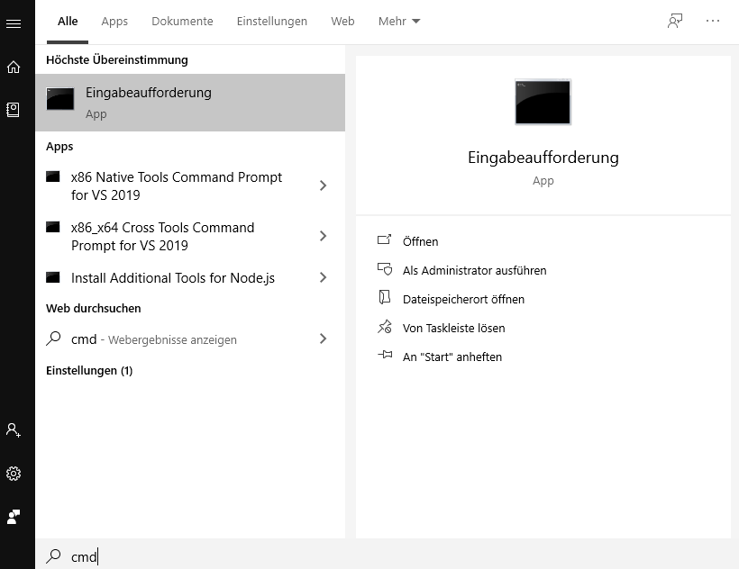
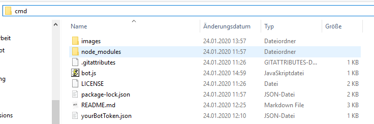
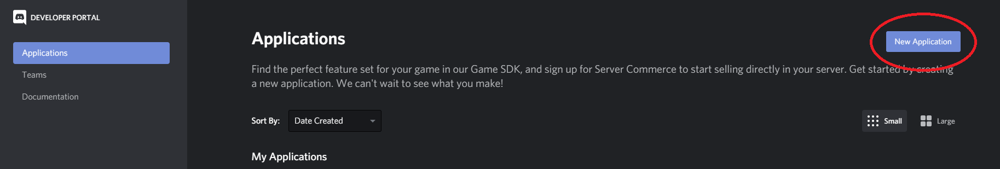
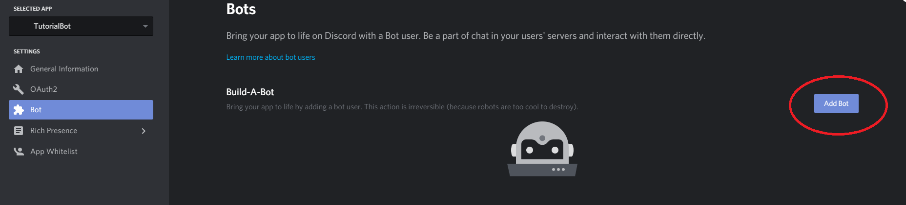
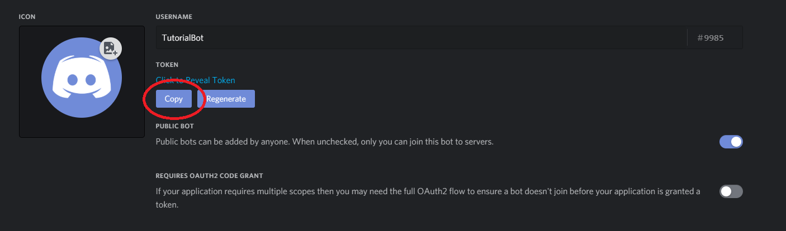
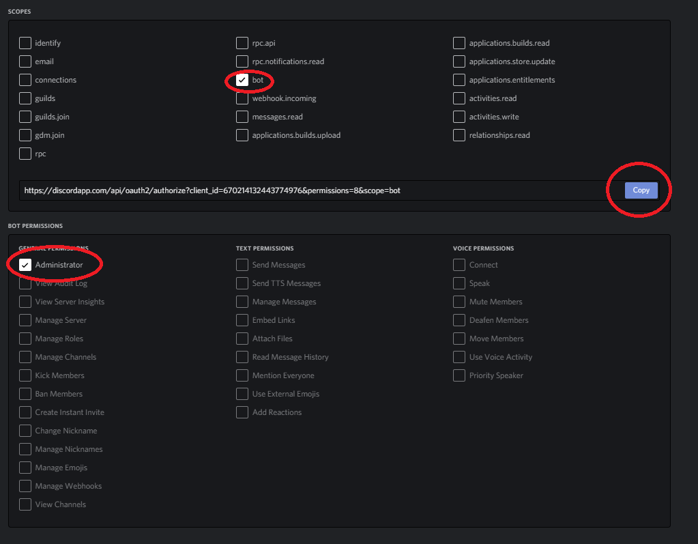
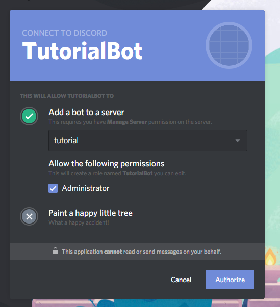
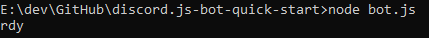
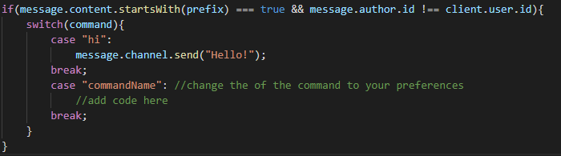

# discord.js Bot Quick Start Guide
This is a small tutorial for everyone who wants to create their first discord.js bot on Windows. 
This architecture will not be scaleable, if you want to a bigger one I suggest checking [this](https://github.com/AnIdiotsGuide/guidebot) out. 

## Preconditions

- You will need some kind of text editor, I recommend [Visual Studio Code](https://code.visualstudio.com/Download).

## To start off

- Clone this repository or download it as a zip and extract it into a folder
- Install install [node.js](https://nodejs.org/en/) download the one where it says *Recommended For Most Users*
- Open windows command prompt by typing **cmd** in the search

- Check if node.js is installed correctly by typing in **node --version**, it should display you the version.
- Check if npm is installed by typing in **npm --version**, it should display you the version
	- npm is a package manager for node.js which you will need in this tutorial
- Head to the the root of the project with the explorer and type in **cmd** in the path bar.

- Type **npm install ** and execute. This will install all the necessary packages.
	- as of now it's:
		- discord.js 

## Creating the bot application on Discord

Head to https://discordapp.com/developers/applications/ and create a new Application. (You need to be logged in for this)

Give it a name of your choice, I will call mine "TutorialBot". The application name won't affect what the bots name will be, the name of the bot can be changed anytime.
Once that is done you will be redirected to a new page. Here you can configure different things of you application.

Head to the **Bot** section, press the **Add Bot** button and confirm the pop-up. 

If you want to you can change the bots name at **Username**.

## Extracting the bot token

Every bot on discord has a unique token. **Never** share this token with anyone to prevent unauthorized use. If you happen to share it by accident you can always **regenerate** a new token.

Now copy that token by clicking on **copy**.

Now open the **yourBotToken.json**  paste the copied token there and save.

## Creating an invite link for your bot

On the Discord developer portal click on the **OAuth2** Section.
On **Scopes** click on **bot** .
On **Bot Permissions** click on **Administrator**. 

Copy the link open it in a browser of your choice. Select the server you want to invite your bot in, note that you will need to be an administrator to invite a bot to it.

And now the bot should be in your server and offline.

## Start up your bot

To start up your bot you need to go the root of the project in cmd and type **node bot.js**. 
When you see **rdy** in the command prompt congrats, your bot is online now. Since you host your bot locally it will only stay up as long as your pc is running. 

If you check Discord you will see that your bot is online now. 
Additionally you can check by typing in any channel **+hi** which the bot will respond to by default.

To stop the process press **CTRL+C** and have the command prompt focused.

## Edit the code

Open the **bot.js** file with your text editor program. You can further add commands by adding more case's in the switch.

As I already mentioned this is really not a scaleable architecture because all your code will end up in just one file and you will very soon get lost in it. It is useful for very small bots or just to get into programming one.

To understand how the API works I recommend the [official discord.js documentation](https://discord.js.org/#/docs/main/stable/general/welcome)

## Optional but recommended

tbd

